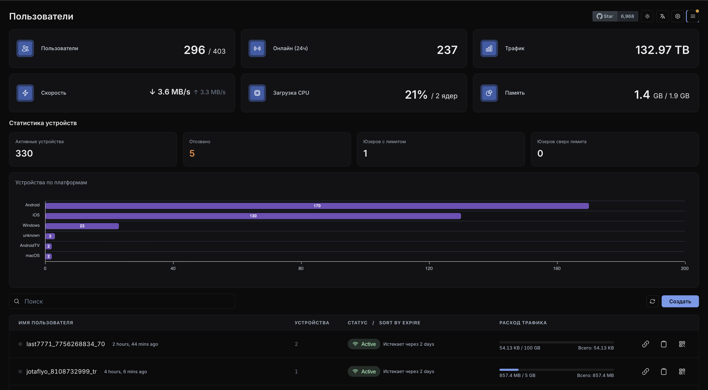

# Marzban yuku-patches

Форк [Gozargah/Marzban](https://github.com/Gozargah/Marzban) `v0.8.4` с патчами для коммерческого
VPN-сервиса. База ветки — тег `v0.8.4` (оригиналы из развёрнутого образа
`gozargah/marzban:latest` байт-в-байт совпадают с тегом).

**Готовый образ:** `ghcr.io/bourbon24k/marzban:0.8.4-yuku-3` (и `:latest`).

## Содержание

1. [CDN/proxy XHTTP GET-uplink](#патч-1--cdnproxy-xhttp-get-uplink)
2. [Стабильность нод](#патч-2--стабильность-нод)
3. [Уведомления клиенту (истёк / лимит)](#патч-3--уведомления-клиенту)
4. [Лимит устройств по HWID + отзыв](#патч-4--лимит-устройств-по-hwid--отзыв)
5. [Лимит трафика по группам хостов](#патч-5--лимит-трафика-по-группам-хостов)
6. [Дашборд: статистика и устройства](#патч-6--дашборд-статистика-и-устройства)
7. [YUKU настройки + надёжность](#патч-7--yuku-настройки--надёжность)
8. [Announce с переменными](#патч-8--announce-с-переменными)
9. [История действий админов](#патч-9--история-действий-админов)
10. [Поиск по HWID](#патч-10--поиск-по-hwid)
11. [Фикс: хосты выпадали из групп](#патч-11--фикс-хосты-выпадали-из-групп-при-сохранении)
12. [RU split-tunnel роутинг и DNS](#патч-12--ru-split-tunnel-роутинг-и-dns-в-подписке)
13. [Автовыбор сервера](#патч-13--автовыбор-сервера-балансировщик-в-подписке)
14. [Несколько автовыборов + боковое меню](#патч-14--несколько-автовыборов--боковое-меню-вместо-бургера)
15. [Фикс: селектор группы показывал «нет»](#патч-15--фикс-селектор-группы-автовыбора-показывал-нет)

### Карта файлов

| Файл | Назначение |
|------|-----------|
| `app/subscription/v2ray.py` | XHTTP GET-uplink поля в подписке |
| `app/subscription/share.py` | уведомления, метки группового лимита, контекст групп |
| `app/routers/subscription.py` | announce + захват HWID + enforcement лимита устройств |
| `app/xray/node.py` | таймауты и `started` (стабильность нод) |
| `app/xray/config.py` | чтение XHTTP-полей из `xray_config.json` |
| `app/xray/__init__.py` | `id` хоста в dict (нужно для маппинга групп) |
| `app/db/models.py` | device_limit, user_devices(+status), host_groups, user_group_usage |
| `app/db/crud.py` | устройства, группы, членство, переопределения лимитов |
| `app/db/base.py` | SQLite WAL + busy_timeout |
| `app/models/user.py`, `app/models/system.py`, `app/models/host_group.py` | Pydantic-схемы |
| `app/routers/user.py`, `app/routers/host_group.py`, `app/routers/system.py` | API |
| `app/jobs/record_usages.py`, `app/jobs/reset_group_usage.py` | учёт и сброс группового трафика |
| `app/utils/concurrency.py` | пул потоков для xray-операций |
| `app/utils/audit.py` | история действий: middleware + контекст обогащения |
| `app/routers/audit.py`, `app/models/audit.py` | API истории (sudo) |
| `app/jobs/purge_audit_logs.py` | ретеншен истории |
| `app/db/migrations/.../yuku000{1..9}_*.py` | миграции БД (аддитивные) |
| `app/dashboard/...` | статистика, устройства, группы, тема, YUKU настройки |

---

## Патч 1 — CDN/proxy XHTTP GET-uplink

### Проблема
CDN/proxy — кэширующий L7-прокси. Он режет `POST`-uplink (`405`), а mainline-XHTTP шлёт uplink
через POST. Решение — `uplinkHTTPMethod: GET`
([XTLS/Xray-core#5414](https://github.com/XTLS/Xray-core/pull/5414), влит в mainline 31.01.2026).
Чтобы это работало, поля XHTTP должны читаться Marzban из `xray_config.json` и попадать в подписку
(VLESS-URL + v2ray-json). Stock Marzban v0.8.4 этих полей не знает и теряет их.

### Что добавлено
**`app/xray/config.py`** — в секции xhttp/splithttp читаются новые поля:
```python
settings["uplinkHTTPMethod"]     = net_settings.get("uplinkHTTPMethod", "")
settings["xPaddingKey"]          = net_settings.get("xPaddingKey", "")
settings["xPaddingMethod"]       = net_settings.get("xPaddingMethod", "")
settings["xPaddingObfsMode"]     = net_settings.get("xPaddingObfsMode", False)
settings["xPaddingPlacement"]    = net_settings.get("xPaddingPlacement", "")
settings["scStreamUpServerSecs"] = net_settings.get("scStreamUpServerSecs", "")
```
**`app/subscription/v2ray.py`** — три бага: `splithttp_config()` не писал новые параметры в config;
`make_stream_setting()` их не передавал; `extra` dict в `vmess`/`vless`/`trojan` содержал только
`uplinkHTTPMethod`. Добавлены все поля, сигнатуры расширены.

> Требуется ядро Xray ≥ 26.x на сервере **и** клиенте.

---

## Патч 2 — стабильность нод

### Проблема
`XRayNode.started` при таймауте бросал `NodeAPIError` вместо `False` — исключение прерывало
`remove_user()` в середине цикла, истёкшие не вычищались со всех нод. Таймауты `/ping`, `/`,
`/connect` были жёстко `3` c — под нагрузкой/свопом ноды массово помечались упавшими → шторм
переподключений.

### Что изменено
```python
@property
def started(self):
    try:
        res = self.make_request("/", timeout=15)   # было timeout=3 БЕЗ try/except
        return res.get('started', False)
    except NodeAPIError:
        return False
```
Таймауты `/ping` и `/connect` подняты `3 → 15` c, `/disconnect` `3 → 10` c.

---

## Патч 3 — уведомления клиенту

### Идея
Stock Marzban истёкшему юзеру отдаёт подписку с реальными (но нерабочими) серверами. Этот патч
вместо мёртвых серверов отдаёт **сервер-уведомление**: имя записи = текст, виден прямо в списке
серверов клиента. Покрыты `expired`, превышение лимита устройств и превышение группового лимита.

### Что добавлено
- Helper `_generate_notice(config_format, lines)` — собирает фейковую подписку из dummy-outbound на
  `127.0.0.1` с именами-сообщениями. Для `v2ray-json` (Happ) — валидный JSON, иначе vless-ссылки.
- Short-circuit в `generate_subscription` для `expired` и при переданных `notice_lines`.
- Тексты уведомлений берутся из БД (YUKU настройки, см. патч 7) с фолбэком на дефолты.

---

## Патч 4 — лимит устройств по HWID + отзыв

### Идея
Marzban/Xray не знают про «устройства»: один UUID работает на неограниченном числе устройств.
Современные клиенты (**Happ**, v2rayTun) шлют `x-hwid` (+ модель/ОС/версия) при запросе подписки.
Панель регистрирует устройства, считает и ограничивает.

### Что добавлено
**БД** (`models.py`, миграции `yuku0001`, `yuku0003`):
- `users.device_limit` (0/NULL = безлимит);
- таблица `user_devices` (hwid, platform, os_version, device_model, user_agent, created_at,
  last_seen, **status**), UNIQUE(user_id, hwid), каскад с юзером;
- `status` (`active`/`revoked`) — отозванные не считаются в лимит, но остаются в истории.

**CRUD** (`crud.py`):
- `register_user_device()` — обрабатывает HWID-клиентов **и** клиентов без HWID
  (псевдо-HWID `unknown-device` по user-agent → закрыт обход через v2rayNG);
- `_touch_device_if_stale()` — дебаунс записи (`DEVICE_TOUCH_DEBOUNCE_SECONDS=600`), чтобы
  повторные обновления подписки не создавали write-storm;
- `revoke_user_device()` — мягкая блокировка; `IntegrityError`-защита от гонок.

**Подписка** (`subscription.py`): `enforce_device_limit()` — регистрирует устройство (с дебаунсом
даже для безлимитных), при превышении отдаёт notice-подписку.

**API** (`user.py`):
- `GET /api/user/{username}/devices` → `{devices, total, device_limit}`
- `DELETE /api/user/{username}/devices/{device_id}`
- `POST /api/user/{username}/devices/{device_id}/revoke`
- лимит — через обычный `PUT /api/user/{username}` (`device_limit`).

### Ограничения
- Полноценно работает с клиентами, шлющими `x-hwid` (**Happ**). Без HWID — учёт по user-agent.
- По умолчанию `device_limit=0` — существующие юзеры без ограничений.


---

## Патч 5 — лимит трафика по группам хостов

### Идея
Отдельный лимит трафика на **именованную группу** нод/хостов (напр. «play2go»), независимо от
общего лимита юзера. Остаток показывается прямо в названии сервера и обновляется; при превышении
сервер заменяется заглушкой. Только явно добавленные в группу юзеры (membership) видят кап и
энфорсятся.

### Что добавлено
**БД** (`models.py`, миграции `yuku0004`–`yuku0006`):
- `host_groups` (name, traffic_limit, reset_strategy, notice_text, **include_master**);
- M2M `host_group_hosts` / `host_group_nodes` (node UNIQUE — нода метрится в одну группу);
- `user_group_usage` (used_traffic, **traffic_limit** per-user override, **member**, reset_at).

**Учёт** (`jobs/record_usages.py`): `record_group_usages()` маппит `node_id → group_id` и апсертит
трафик. Xray даёт только per-node статистику; `include_master=True` привязывает трафик мастера
(`node_id=None`) к группе. Сброс — `jobs/reset_group_usage.py` (почасовой, по reset_strategy).

**Подписка** (`share.py`): `build_group_context(user)` собирает per-user состояние групп (только для
member); `process_inbounds_and_tags` инжектит `{GROUP_USED}`/`{GROUP_LIMIT}`/`{GROUP_REMAINING}` (в
ГБ), авто-дописывает ` (X.X/Y.Y ГБ)` к названию хоста, при превышении — одна заглушка на группу.

**API** (`host_group.py`):
- CRUD групп: `GET/POST/PUT/DELETE /api/host-group[/{id}]`, `GET /api/host-candidates`;
- per-user: `GET /api/user/{u}/group-usage`, `PUT /api/user/{u}/group/{gid}`
  (`{member?, traffic_limit?, set_limit}`), `POST /api/user/{u}/group/{gid}/reset`;
- 409 при конфликте ноды/мастера/имени.

**Дашборд**: модалка управления группами (`HostGroupsModal`), в карточке юзера — чекбокс «В группе»
+ переопределение лимита.

> Задание лимита **не** добавляет юзера в группу автоматически — членство ставится явно
> (чекбокс или `member:true`).

---

## Патч 6 — дашборд: статистика и устройства

- 6 карточек статистики: пользователи, онлайн за 24ч, трафик, live-скорость ↓/↑, CPU, память
  (`Statistics.tsx`).
- Блок «Статистика устройств» (`DeviceStats.tsx`, `GET /api/system/devices`): активные/отозванные
  устройства, юзеры с лимитом/сверх лимита, горизонтальный график по платформам (ApexCharts).
- Графики-бары вместо доната для использования нод (`UsageFilter.createBarUsageConfig`).
- Карточка устройства: HWID, модель, ОС, версия ОС, user-agent, первый/последний вход, кнопки
  отзыва (оранжевая) и удаления (`UserDialog.tsx`).
- Почти чёрная тёмная тема (`chakra.config.ts`, `themeColor.ts`).
- `RouteError.tsx` — редирект на логин только при 401/403 (раньше любая ошибка рендера разлогинивала).



---

## Патч 7 — YUKU настройки + надёжность

**YUKU настройки** (модалка в шапке, sudo): тексты announce / истёкшей подписки / превышения лимита
устройств и лимит устройств по умолчанию — редактируются из UI, хранятся в таблице `yuku_settings`
(миграция `yuku0002`), кэш 30 c.


**Надёжность под нагрузкой**:
- `app/db/base.py` — SQLite `PRAGMA journal_mode=WAL`, `busy_timeout=30000`,
  `synchronous=NORMAL`, `connect_args timeout=30`. Убирает «database is locked» на `/sub` при
  параллельной нагрузке.
- `app/utils/concurrency.py` — глобальный `ThreadPoolExecutor`
  (`XRAY_THREAD_POOL_SIZE=20`) вместо нового потока на каждую xray-операцию; graceful shutdown.

---

## Патч 8 — announce с переменными

Announce в шапке подписки — не фиксированная строка, а шаблон, который рендерится под каждого
юзера при отдаче `/sub` (как в референсных панелях: «Дней осталось: 3 / Устройств: 2/5»).

- `app/subscription/share.py` — `render_announce()` / `get_announce_text(user)` используют тот же
  `setup_format_variables()` + `format_map`, что и remark хостов, поэтому имена переменных
  совпадают в обоих местах. Кривой шаблон (одиночные `{`) → отдаётся сырой текст, `/sub` не падает.
- Добавлены переменные `DEVICE_COUNT` / `DEVICE_LIMIT` / `DEVICE_LEFT` (0/NULL лимит → `∞`).
  Доступны и в remark хостов.
- `invalidate_yuku_settings_cache()` вызывается из `PUT /api/yuku/settings` — раньше правка
  announce применялась только через 30 c (кэш настроек не сбрасывался).
- `GET /api/yuku/announce-variables` — список переменных.
- Дашборд: у поля announce кликабельные чипы переменных (вставка по курсору) и живое превью.

Доступные переменные: `USERNAME`, `DAYS_LEFT`, `TIME_LEFT`, `EXPIRE_DATE`, `DATA_USAGE`,
`DATA_LIMIT`, `DATA_LEFT`, `DEVICE_COUNT`, `DEVICE_LIMIT`, `DEVICE_LEFT`, `GROUP_NAME`,
`GROUP_USED`, `GROUP_LIMIT`, `GROUP_LEFT`, `GROUPS`, `STATUS_EMOJI`, `STATUS_TEXT`, `SERVER_IP`.
`DATA_*` — общий трафик юзера, `GROUP_*` — его трафик в группе хостов (учитывается per-user
override лимита); `{GROUPS}` — строка на каждую группу. Группа тянется из БД только если шаблон
реально упоминает `{GROUP`.

**Выравнивание** (`announce_align`: `left` / `center`): при `center` строки дополняются пробелами
до центра относительно самой длинной строки блока. Ширина считается с учётом эмодзи/CJK
(2 ячейки) и селекторов вариаций (0). ⚠️ Длинный абзац в шаблоне уводит короткие строки далеко
вправо (в клиенте они могут перенестись) — держите строки сопоставимой длины.

---

## Патч 9 — история действий админов

Таблица `admin_audit_logs` (миграция `yuku0008`): кто, откуда (IP с учётом `X-Forwarded-For`),
что сделал, и точные значения «до → после». Захват в два слоя, без правки сигнатур эндпоинтов:

- **`AuditMiddleware`** (`app/utils/audit.py`) — пишет строку на каждый мутирующий `/api` запрос:
  админ из bearer-токена, IP, user-agent, метод/путь, код ответа, имя действия по карте роутов.
  GET, `/sub` и шум неавторизованных 401 пропускаются.
- **`audit.detail()`** — обогащает ту же строку диффом там, где он есть: логины (успех/провал),
  юзеры (create/modify/delete/reset/revoke/set-owner), устройства, хосты, ядро, админы, группы,
  шаблоны, YUKU настройки. Мутирует dict в `ContextVar` **на месте**: Starlette отдаёт нижнему
  таску копию контекста, поэтому пере-присваивание переменной наверх бы не дошло.

Чувствительное не сохраняется: ключи вида `password`/`hash`/`token` → `***`, длинные строки
режутся, а пароль, который `report.login` получает при неудачном входе, в историю не попадает.
Дифф конфига ядра — только изменённые секции и теги инбаундов, не весь xray JSON.

`admin_username` — обычная колонка, а не только FK: env-судоер (`SUDO_USERNAME`) строки в
`admins` не имеет и иначе был бы неатрибутируемым.

- `GET /api/audit-logs` (+ `/meta`), sudo, пагинация + фильтры (админ, действие, объект, даты;
  поиск по объекту/IP/пути).
- `AUDIT_LOG_RETENTION_DAYS` (дефолт 90, `0` = хранить всегда) + суточный джоб очистки,
  инертный до применения миграции.
- Дашборд: пункт «История действий» (sudo) — таблица время/админ/IP/действие/объект/код,
  строка раскрывается в пофайловый дифф «старое → новое».

Запись аудита — best-effort: любая ошибка логируется и глотается, чтобы аудит не мог сломать
само действие.

---

## Патч 10 — поиск по HWID

Ввод HWID (или модели устройства) в поиск юзеров панели находит владельца. Раньше `search` матчил
только `users.username` и `users.note`.

- `crud.get_users()` — в OR-клаузу добавлен `User.devices.any(hwid ilike | device_model ilike)`.
  Именно `.any()` (EXISTS), не `join`: `return_with_count` считает этот же запрос, а join к
  `user_devices` размножил бы строки и раздул `total`.
- Миграция `yuku0009` + `index=True` на `UserDevice.hwid`: существующий unique — `(user_id, hwid)`,
  с ведущим `user_id` он поиск по одному hwid не обслуживает.

Не-sudo админы остаются в своей области видимости (`admins=[admin.username]` в `routers/user.py`).

---

## Патч 11 — фикс: хосты выпадали из групп при сохранении

`crud.update_hosts()` пересоздавал **все** строки хостов инбаунда (`inbound.hosts = [...]`), поэтому
после каждого сохранения в «Host Settings» у хостов менялись id. Связи `host_group_hosts` ведут на
`hosts.id`, так что группы теряли свои хосты — лимиты переставали показываться и энфорситься.

- Строки теперь **обновляются на месте**. Входящие хосты сначала сопоставляются по идентичности
  (`remark/address/port/path/sni/host`) — нетронутый хост сохраняет свою строку даже при смене
  порядка, — а остаток сопоставляется позиционно (это и есть правка одного поля у одного хоста).
  Удаляются только реально удалённые хосты.
- `_host_column_value()` подставляет дефолт колонки, если в payload пришёл NULL для NOT NULL поля
  (`mux_enable`, `random_user_agent`, `use_sni_as_host`, `security`, `alpn`, `fingerprint`).
  При INSERT это делалось само, при UPDATE — нет (иначе IntegrityError).
- **`PRAGMA foreign_keys` в SQLite выключен**, поэтому `ON DELETE CASCADE` на `host_group_hosts`
  никогда не срабатывал: в проде было 30 связей, из которых живых только 4. Осиротевшие строки —
  не просто мусор: SQLite переиспользует id, и брошенная связь может позже «прилипнуть» к новому
  чужому хосту вместе с лимитом группы. Теперь связи удаляются явно вместе с хостом.

---

## Патч 12 — RU split-tunnel роутинг и DNS в подписке

Профиль роутинга/DNS для `v2ray-json`, **выключен по умолчанию**. Тумблер в YUKU-настройках
(`subscription_routing`: `off` / `yuku_routing`), применяется без рестарта; при `off` конфиг
байт-в-байт как раньше.

Профиль — **объединение** нашего прод-шаблона с моделью референсной RU-панели, ничего из нашего
не выброшено. Порядок правил (Xray берёт первое совпадение):

| # | Правило | Зачем |
|---|---|---|
| 1 | 7 доменов (2ip, whoer, browserleaks, yoomoney, apple) → `proxy` | Первым не случайно: `2ip.ru` — это `.ru`, и правило 3 иначе отдало бы проверку IP напрямую, показав юзеру его реальный адрес |
| 2 | `17.0.0.0/8` → `proxy` | APNs в туннеле, иначе ломаются пуши iOS |
| 3 | 640 RU/локальных доменов → `direct` | Объединение наших 88 и их 596 (пересечение учтено): банки, госуслуги, налоговая, VK, маркетплейсы, имена локалки, зоны обратного DNS |
| 4 | `geoip:private` + `geoip:ru` → `direct` | Полное покрытие РФ. У референса тут 6728 инлайновых CIDR — замер показал, что это в основном одиночные `/32`, мимо Сбера, Ростелекома, МТС и почти всего Яндекса, ценой 126 КБ на конфиг. `geoip:ru` заодно держит в direct DoH-резолвер Яндекса и IP налоговой — DoH-запрос через зарубежный выход вернёт зарубежные адреса, и вся схема развалится |
| 5 | `bittorrent` → `direct` | Сохранено из нашего шаблона |
| 6 | всё остальное tcp/udp → `proxy` | Явная политика «по умолчанию в VPN» |

`domainStrategy` = `IPIfNonMatch` вместо `AsIs`: при `AsIs` несовпавший домен не резолвится
локально, поэтому geoip-правила почти никогда не срабатывают и `geoip:ru` был бы декорацией.

**DNS:** DoH Яндекса (`77.88.8.8`) для тех же 640 доменов, DoH Google для остального, статические
пины `lkfl2/lknpd.nalog.ru`. ⚠️ Яндекс видит RU-запросы юзеров с их настоящих IP. Sniffing получил
`quic`, иначе правила по доменам не применяются к HTTP/3.

Блокировка рекламы/телеметрии у референса есть — **сознательно не взята**.

**Что было найдено и починено по ходу:** в шаблоне у записей `push.apple.com` и `apple.com` был
хвостовой невидимый U+2060, из-за которого правило не матчилось вообще; freedom-outbound из профиля
не добавляется, если тег уже есть в шаблоне (дубль тега — Xray отвергает весь конфиг).

**Производительность:** шаблон парсится один раз, блоки шарятся между конфигами (иначе 34 хоста =
34 разбора 38-КБ шаблона). 34 хоста: 266 КБ при `off`, 995 КБ при `on`. Профиль повторяется дословно,
поэтому жмётся ~36×: живая подписка из 10 конфигов — 296 КБ raw, **8.4 КБ по сети**, TTFB 37 мс.
Для этого в nginx добавлен `gzip_types application/json …` — до этого `/sub` не жался вообще.

Валидировано настоящим `xray -test` (24.12.31) против прод-`geoip.dat`: `Configuration OK`.

---

## Патч 13 — автовыбор сервера (балансировщик в подписке)

Галка **«участвует в автовыборе»** в настройках хоста (`hosts.auto_select`, по умолчанию `0`).
Отмеченные хосты дополнительно собираются в **одну общую запись подписки**, где выбор сервера
делает сам Xray на стороне клиента — по замерам, а не по тому, что юзер ткнул пальцем.

Хост при этом **никуда не девается**: он остаётся в списке как обычно, автовыбор — дополнительная
запись, всегда первая в списке (независимо от `reverse`).

### Как устроена запись

| Блок | Содержимое |
|------|-----------|
| `outbounds` | отмеченные хосты как `proxy`, `proxy-2`, `proxy-3`, … + `direct` (freedom) |
| `routing.balancers` | один балансировщик `auto`, `selector: ["proxy"]` (префикс ловит все `proxy-N`), `fallbackTag: direct` |
| `routing.rules` | всё, что раньше шло в `proxy`, теперь идёт в балансировщик |
| `burstObservatory` | замеры RTT по каждому аутбаунду — их и читает стратегия `leastLoad` |

Стратегии: `leastLoad` (по умолчанию, через `burstObservatory`), `leastPing` (через обычный
`observatory`), `roundRobin`, `random` — последним двум замеры не нужны, и блок пинга не пишется.
Настройки `leastLoad` взяты у референса: `baselines ["1s"]`, `maxRTT 1s`, `tolerance 0.01`,
`expected 2`.

### Настройки (YUKU-настройки, применяются без рестарта)

| Ключ | По умолчанию | Что делает |
|------|--------------|------------|
| `auto_select_remark` | `🌍 Автовыбор` | имя записи; переменные как в announce (`{USERNAME}` и т.д.) |
| `auto_select_strategy` | `leastLoad` | стратегия балансировщика; неизвестное значение отвергается на PUT |
| `auto_select_interval` | `1m` | период замеров |
| `auto_select_destination` | `http://www.gstatic.com/generate_204` | URL для пинга |

### Границы

- Только **`v2ray-json`**. Полный конфиг Xray умеет отдавать лишь этот формат, а получают его
  v2rayN/NG, Streisand, Happ и INCY (см. `resolve_format`). Clash, sing-box, outline и обычные
  vless-ссылки не меняются вообще — там балансировщик выразить нечем.
- **Меньше двух отмеченных хостов — записи нет.** Балансировщик над одним сервером — это тот же
  сервер под вторым именем; подписка в этом случае байт-в-байт как раньше.
- Хост, отрезанный лимитом трафика группы, в автовыбор не попадает — иначе лимит обходился бы
  через эту запись.

### Стыковка с патчем 12

Если профиль роутинга включён, автовыбор **не подменяет** его правила, а переписывает у них
`outboundTag: proxy` → `balancerTag: auto`. Правила `direct` (RU-домены, `geoip:ru`, bittorrent)
остаются как есть: split-tunnel продолжает работать, а в туннель ходит уже балансировщик.
Обычные конфиги хостов профиль не трогает.

Если профиль выключен, пишется минимальный роутинг: `bittorrent → direct`, остальное `tcp,udp` →
балансировщик.

Хосту с `fragment`/`noise` внутри записи выдаётся собственный dialer-аутбаунд (`dialer-proxy-2`
и т.д.) — при общем теге `dialer` Xray отверг бы весь конфиг из-за дубля.

Валидировано настоящим `xray -test` (26.6.1) на боевом конфиге из 8 отмеченных хостов
(reality/tcp и xhttp/tls вперемешку, профиль роутинга включён): `Configuration OK`.

### ⚠️ Как это раскатано на проде

Боевой контейнер собран **не из образа**: патчи 8–13 залиты в него через `docker cp` поверх
`ghcr.io/bourbon24k/marzban:0.8.4-yuku-5`, в самом образе их нет. Отсюда:

- **`docker compose up -d`, `down`, `pull` или любое пересоздание контейнера убивает панель.**
  Код откатится к образу, а `alembic upgrade head` упадёт: в образе нет ревизий `yuku0008…yuku0010`,
  которые уже прописаны в боевой БД.
- Безопасно только `docker restart marzban-marzban-1` — слой контейнера при этом сохраняется.
- Точка отката на момент патча 13: образ-снапшот `marzban-prod-snapshot:20260804-020257`,
  плюс `/home/bourbon/marzban-backups/` (БД, `/code` целиком, compose, xray_config).
- Правильное лечение — собрать образ `0.8.4-yuku-6` из этой ветки и перевести compose на него;
  тогда `docker cp` больше не нужен.

Ещё одно расхождение прода с гитом (не связано с этим патчем): в боевом
`app/templates/v2ray/yuku_routing.json` 11 доменов Тинькофф/Т-Банка перенесены из правила `direct`
в правило `proxy` — на проде Тинькофф ходит через VPN. В репозитории они всё ещё в `direct`.

---

## Патч 14 — несколько автовыборов + боковое меню вместо бургера

### Несколько записей автовыбора

`hosts.auto_select` из флага стал **номером группы**: `0` — не участвует, `N` — группа N.
В настройках хоста вместо галки селектор с названиями групп, группы редактируются в
YUKU-настройках (`auto_select_groups` — JSON-список; ключи `auto_select_*` от патча 13
остаются описанием группы 1, поэтому уже настроенная запись не теряется).

Каждая группа даёт свою запись в подписке со своей стратегией и своим блоком замеров:
`leastLoad` пишет `burstObservatory`, `leastPing` — обычный `observatory`, `roundRobin` и
`random` не пишут ничего. Записи идут в начале подписки по порядку групп. Правило «меньше
двух хостов — записи нет» действует на каждую группу отдельно.

Удаление группы, в которой ещё есть хосты, **отклоняется на PUT** (400 с текстом, какая
группа занята): иначе хосты указывали бы на несуществующий номер и просто молча исчезли бы
из подписки.

Миграция `yuku0011groups` на SQLite ничего не делает намеренно — типизация динамическая,
записанные `0/1` уже читаются как числа, а `ALTER` там означает пересборку таблицы, что
порвало бы ссылки `host_group_hosts` на `hosts.id` (та же грабля, что в `crud.update_hosts`).

Проверено на копии боевой базы: две группы (5 reality-хостов и 3 xhttp) дают две записи с
разными стратегиями, обе — `Configuration OK` у настоящего `xray -test` 26.6.1.

### Боковое меню и страницы

Бургер-меню в шапке убрано. Слева — сворачиваемое меню (состояние в `localStorage`,
ключ `yuku-sidebar-collapsed`; в свёрнутом виде остаются иконки с тултипами), каждый пункт
живёт на своём маршруте: `/hosts`, `/nodes`, `/nodes-usage`, `/reset-usage`, `/core`,
`/yuku`, `/groups`, `/audit`. Пользователи — `/`.

Экраны не переписывались: они по-прежнему те же компоненты, но парты модалки импортируются
из `components/PageOrModal`. Внутри `<PageMode>` (то есть на своём маршруте) оверлей,
центрирование и крестик исчезают, и остаётся содержимое страницы; в обычном контексте всё
работает как раньше. Экраны, живущие в сторе дашборда (хосты, ноды, использование, сброс
трафика, ядро), включаются на время жизни маршрута, поэтому данные грузятся ровно как
раньше, а «Отмена»/успешное сохранение возвращают на список пользователей.

### Кэш локалей

`queryStringParams: { v: … }` в `i18n.ts` — обязательный бамп при любой правке локалей:
у JSON-ов нет `Cache-Control`, i18next тянет их XHR-ом, а на XHR не распространяется сброс
кэша по Ctrl+Shift+R. Из-за незабампленного токена новые ключи не подхватились и в панели
были видны сырые `hostsDialog.autoSelect`.

---

## Патч 15 — фикс: селектор группы автовыбора показывал «нет»

После перезахода в панель хост, состоящий в группе, показывал в селекторе «не участвует».
В базе при этом лежал верный номер группы — врал только интерфейс.

Селектор зарегистрирован через `form.register`, то есть неконтролируемый, а список групп
приходит отдельным запросом (`useAutoSelectGroups` → `/yuku/auto-select`) и на свежей загрузке
страницы кэша не имеет. `form.reset(hosts)` успевает раньше, `<option value="N">` в DOM ещё нет,
браузер молча отбрасывает присвоение, и селект остаётся на первом пункте. Когда группы
дорисовываются, React добавляет опции, но значение повторно не выставляет.

Данные это не портило: внутреннее состояние формы держало правильный номер, поэтому сохранение
других полей группу не сбрасывало. Опасность была в другом — увидев «нет» и тронув селектор,
админ записывал в базу настоящий ноль.

Лечение — пересинхронизировать значение, когда опции появились (`Hosts.tsx`, компонент строки
хоста):

```tsx
useEffect(() => {
  if (!autoSelectGroups.length) return;
  const path = name("auto_select") as any;
  form.setValue(path, (Number(form.getValues(path)) || 0) as any);
}, [autoSelectGroups.length]);
```

Тот же класс гонки ждёт любое поле-селектор, чьи опции грузятся асинхронно. Радикальнее —
перевести селектор на `Controller`, тогда значение всегда идёт из состояния формы.

---

## Сборка дашборда — две грабли

Обе стоили боевой панели: после подмены `build` она открывалась с «Что-то пошло не так»,
а в консоли висел `GET /admin 404`.

**1. `.env` с `VITE_BASE_API` обязателен.** В `service/http.ts` стоит
`baseURL: import.meta.env.VITE_BASE_API`. В репозитории лежит только `.env.example` с пустым
значением, поэтому сборка «из чистого клона» даёт `baseURL: undefined`, и весь API уезжает
в корень (`/admin` вместо `/api/admin`). Перед сборкой:

```bash
printf 'VITE_BASE_API=/api/\n' > .env
```

**2. `outDir`/`assetsDir` не заданы в `vite.config.ts`.** По умолчанию vite кладёт результат в
`dist/assets`, а Marzban отдаёт `build/statics`. Без флагов `index.html` ссылается на `/assets/…`,
которых сервер не знает. Собирать так:

```bash
docker run --rm -v "$PWD":/app -w /app node:16.17-bullseye \
  sh -c "npx tsc && npx vite build --outDir build --assetsDir statics"
```

`404.html` vite не генерирует — переносить из предыдущей сборки.

**Проверять бандл до раскладки**, а не после:

```bash
grep -o '.\{25\}baseURL.\{25\}' build/statics/index.*.js   # ждём baseURL:"/api/"
```

Совпадение хеша `vendor.*.js` с предыдущей рабочей сборкой — хороший признак, что окружение
собрано тем же.

---

## Сборка и деплой

```bash
# готовый образ
docker pull ghcr.io/bourbon24k/marzban:0.8.4-yuku-3

# или собрать из форка
docker build -t ghcr.io/bourbon24k/marzban:0.8.4-yuku-3 .
```

`docker-compose.yml` (минимум):
```yaml
services:
  marzban:
    image: ghcr.io/bourbon24k/marzban:0.8.4-yuku-3
    restart: always
    env_file: .env
    network_mode: host
    volumes:
      - /var/lib/marzban:/var/lib/marzban
```

### Рекомендуемые env (`/opt/marzban/.env`)
- `XRAY_LOG_LEVEL=warning` — защита от переполнения диска X-Padding-строками XHTTP.
- `XRAY_THREAD_POOL_SIZE=20`, `DEVICE_TOUCH_DEBOUNCE_SECONDS=600` (опционально).

### Миграции
Все миграции аддитивные (`yuku0001`–`yuku0006`), применяются автоматически на старте
(`alembic upgrade head`). На существующих юзеров не влияют (device_limit=0, нет членства в группах).

### Деплой патчей
> ⚠️ **Не использовать `docker cp /dev/stdin`** — он создаёт симлинк на `/proc/self/fd/0`, а не
> файл, и ломает код. Только `docker cp <реальный_файл>` или bind-mount файла в compose. После
> копирования проверять `wc -c` (байты) и `python3 -m py_compile`.

---

*Базовый проект — [Marzban](https://github.com/Gozargah/Marzban), лицензия AGPL-3.0.
Эти патчи распространяются на тех же условиях.*
